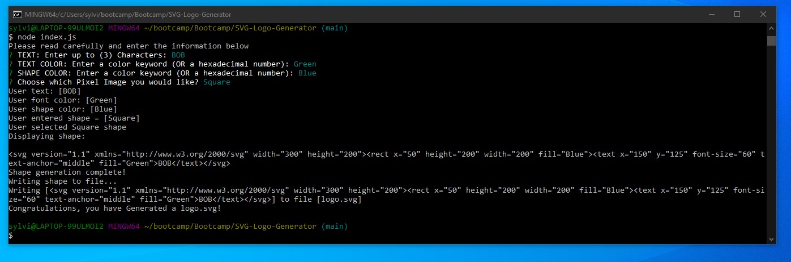
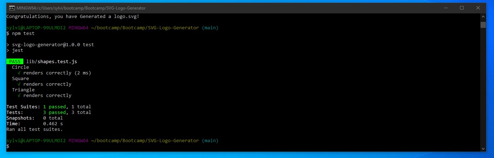

# SVG LOGO Generator

## Description:
The application is designed to make creating an SVG image easier based on simple command prompts.

## Repository:
[Solution URL Link](https://github.com/MagMillen-Dutka/SVG-Logo-Generator)

## Walkthrough Video:
[Click Here to Watch]()

## Screenshots:
### Figure 1. Command line application
 
### Figure 2. Jest Testing "npm test"



## Table of Contents:
* [License](#license)
* [User Story](#user-story)
* [Acceptance Criteria](#acceptance-criteria)
* [Installation Process](#installation-process)
* [Sources](#sources)

## License
[](https://opensource.org/licenses/MIT)

## User Story
```md
AS a freelance web developer
I WANT to generate a simple logo for my projects
SO THAT I don't have to pay a graphic designer
```

## Acceptance Criteria
```md
GIVEN a command-line application that accepts user input
WHEN I am prompted for text
THEN I can enter up to three characters
WHEN I am prompted for the text color
THEN I can enter a color keyword (OR a hexadecimal number)
WHEN I am prompted for a shape
THEN I am presented with a list of shapes to choose from: circle, triangle, and square
WHEN I am prompted for the shape's color
THEN I can enter a color keyword (OR a hexadecimal number)
WHEN I have entered input for all the prompts
THEN an SVG file is created named `logo.svg`
AND the output text "Generated logo.svg" is printed in the command line
WHEN I open the `logo.svg` file in a browser
THEN I am shown a 300x200 pixel image that matches the criteria I entered
```


## Installation Process
1. Clone the code from the repository.
2. Install the following: 
* Node.JS [Version 16.18.1](https://nodejs.org/en/blog/release/v16.18.1/)
* Jest [Version 29.4.3](https://www.npmjs.com/package/jest)
* Inquirer.js: [Version 8.2.4](https://www.npmjs.com/package/inquirer/v/8.2.4)
3. Open the cloned repository in any source code editor.
4. Open the integrated terminal for the document and complete the respective installation guides provided above in section (2.) to ensure the cloned documentation will operate.

## Sources

Majority of code referenced from [ThomasCalle](https://github.com/ThomasCalle), from his YouTube video which can be found here: [Video](https://www.youtube.com/watch?v=GJYMcLus3v0&t=11s) 

Amendments made to original coding to ensure it worked more efficiently.
